***
# LucidOBS DEVLOG
***
## Repo skeleton
**TODO**
- Docker Compose stack: Grafana, Prometheus, Loki, OpenTelemetry Collector
- Grafana provisioning for datasources (Prometheus + Loki)
- Stub CLI (`lucidobs up`, `lucidobs down`)

**Why this design**
- Local-first, no Kubernetes: emphasis is on observability concepts for now.
- Grafana provisioning for convenient dashboards and datasources appearing without manual setup.
- Prometheus scrapes the OTel Collector’s Prometheus exporter endpoint. Even before ICU vitals are generated and emitted, this gives a real target to validate wiring and networking.

**Key concepts**
- **OpenTelemetry (OTel)** is the standard API and protocol family for emitting telemetry (metrics/logs/traces).
- **OTLP** is the transport format used by OTel SDKs to send telemetry to a collector (HTTP or gRPC).
- **Collector** is a router: it receives telemetry, optionally processes it (batching, filtering), then exports it elsewhere.
- **Prometheus** is pull-based: it scrapes an HTTP endpoint on a refresh schedule.
- **Grafana** visualizes data and manages alerts; it reads from datasources like Prometheus (metrics) and Loki (logs) to a central dashboard platform.
- **Loki** stores logs and is queried with **LogQL**.

**Verification**
1) Boot stack:
   - `lucidobs up`
2) Open Grafana:
   - http://localhost:3000 (admin/admin)
   - Confirm datasources exist: Prometheus + Loki
3) Verify Prometheus target is healthy:
   - Prometheus: http://localhost:9090
   - Prometheus target: http://localhost:9090/targets
   - Expect `otel-collector` target to be **UP**
4) Verify collector health endpoint:
   - http://localhost:13133

### Screenshots

#### Grafana Datasources Provisioned

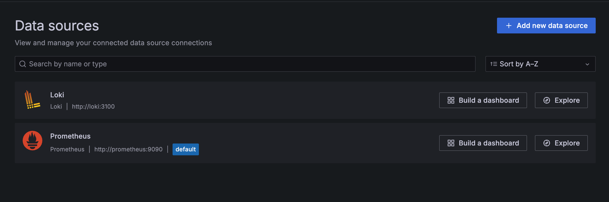

Grafana automatically provisioned Prometheus and Loki datasources via configuration files. This confirms the visualization layer is correctly connected to both metrics and log backends without manual UI setup.

---

#### Prometheus Scrape Targets Healthy

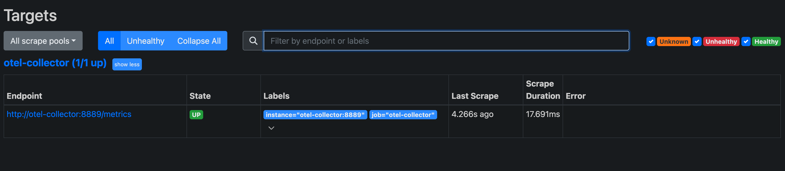

Prometheus successfully scrapes the OpenTelemetry Collector Prometheus exporter endpoint. This verifies:

- Docker network connectivity
- Collector exporter configuration correctness
- Prometheus scrape configuration validity

This confirms that the telemetry pipeline is structurally functional.

---

#### OpenTelemetry Collector Health Endpoint

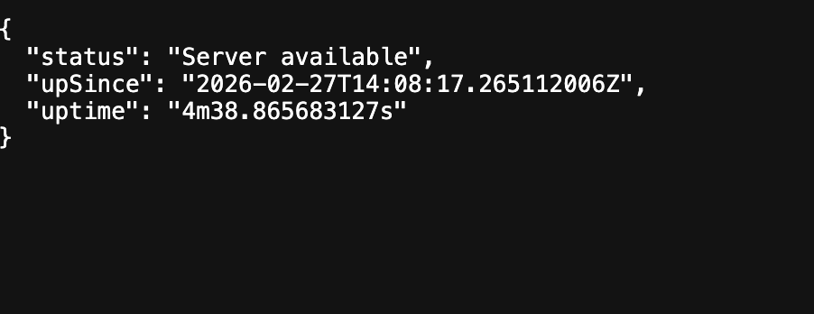

The collector health endpoint confirms the OpenTelemetry Collector service is running and accepting telemetry. This service acts as the central routing hub for all telemetry signals in LucidOBS.

---

**status: COMPLETE**

Stack boots successfully. Prometheus confirms collector scrape target healthy. Grafana datasources provisioned automatically.

---

## Structured logs → Loki → Grafana
**TODO**
- Python telemetry generator that emits structured JSON logs (JSONL) to stdout and `runtime/logs/telemetry.jsonl`
- OpenTelemetry Collector `filelog` receiver tails the JSONL file and exports logs to Loki
- Grafana dashboard **“LucidOBS - Latest Events”** to view recent telemetry events

**Why this design**
- Used the OTel Collector `filelog` receiver instead of adding Promtail to keep the system smaller and easier to review.
- Logs are written locally first (file and stdout), then ingested by the observability pipeline. This makes it local-first and makes it easy to debug by inspecting the raw log file.

**Key concepts**
- **Structured logging**: logs are JSON objects, not free-text. This makes filtering and parsing more reliable.
- **JSONL**: one JSON object per line. It’s append-friendly and tail-friendly, favourable for logs.
- **Loki**: log store optimized for indexing labels and scanning log content.
- **LogQL**: Loki’s query language. Starts with `{service_name="lucidobs"}` to retrieve all LucidOBS logs.

**Verification**
1) Booted the stack: `lucidobs up`
2) Generated logs: `lucidobs run --patients 10 --rate 1 --seed 42`
3) Confirmed file output: `tail -n 5 runtime/logs/telemetry.jsonl`
4) In Grafana (Explored Loki), query: `{service_name="lucidobs"}`
5) New telemetry_sample log lines continuously appeared

---

### Screenshots

#### Live ICU Telemetry Log Stream (Grafana Dashboard)

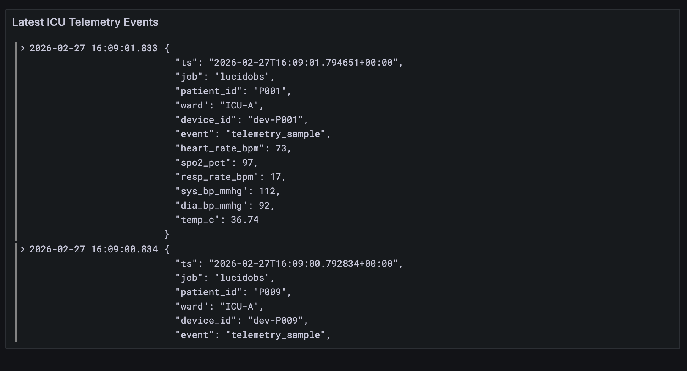

Grafana dashboard displaying real-time ICU telemetry logs ingested via the OpenTelemetry Collector and stored in Loki.

End-to-end log ingestion pipeline functionality is confirmed.

---

#### LogQL Query in Grafana Explore

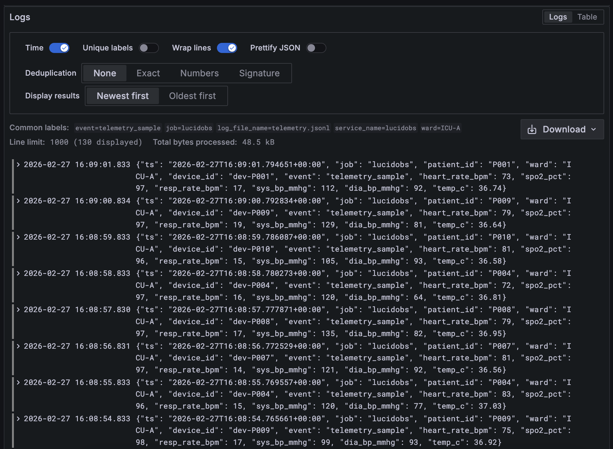

Direct LogQL query `{service_name="lucidobs"}` retrieving structured telemetry events.

This verifies logs are indexed and queryable independently of dashboards.

---

#### Raw JSONL Telemetry File

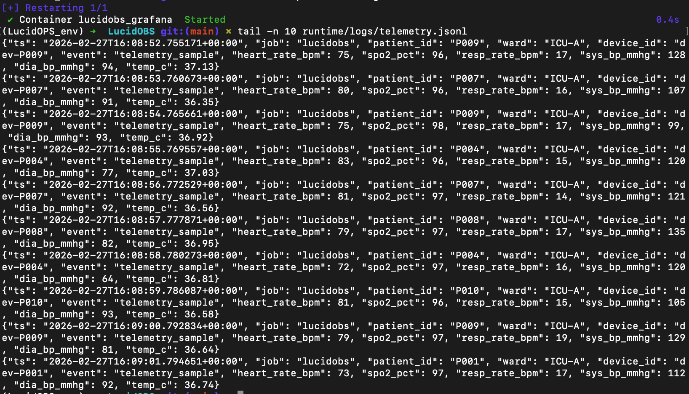

Local JSONL log file written by the telemetry generator.

This demonstrates the source of truth for telemetry before ingestion into the observability pipeline.

---

**status: COMPLETE**

Patient logs are streamed displaying real-time ICU telemetry logs on the Grafana dashboard.

---

## OTel metrics → Prometheus → Grafana
**TODO**
- OpenTelemetry metrics emission for ICU vitals using ObservableGauges (latest value)
- OTLP HTTP export from generator to the OpenTelemetry Collector
- Prometheus scraping of collector’s Prometheus exporter endpoint continues to work
- Grafana dashboards:
  - ICU Overview (multiple patients)
  - Patient Detail (single patient drill-down)

**Why this design**
- Vitals are best represented as “latest value per patient” metrics. ObservableGauges match that mental model cleanly.
- Can reuse the existing OTLP receiver and Prometheus exporter in the collector to keep the system small.
- Labels (`patient_id`, `ward`, `device_id`) make per-patient drill-down and filtering trivial.

**Key concepts**
- **OTLP**: protocol used to ship metrics from the generator to the collector (push).
- **Prometheus**: pull-based, scrapes the collector endpoint and stores time-series.
- **Labels**: dimensions that let you slice metrics per patient or ward in dashboards and alerts.

**verification**
1) `lucidobs up`
2) `lucidobs run --patients 10 --rate 1 --seed 42`
3) In Prometheus (Graph), queried `icu_heart_rate_bpm` and confirm series exist with `patient_id`
4) In Grafana, open:
   - “LucidOBS - ICU Overview”
   - “LucidOBS - Patient Detail”
   and confirm lines are updating.

---

### Screenshots

#### Prometheus Metric Query: icu_heart_rate_bpm

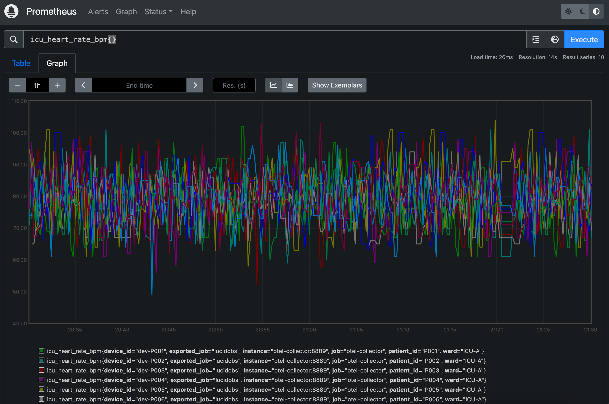

Prometheus successfully scraping ICU vitals metrics from the OpenTelemetry Collector.

Each time-series contains labels such as patient_id, ward, and device_id, enabling per-patient analysis.

---

#### ICU Overview Dashboard

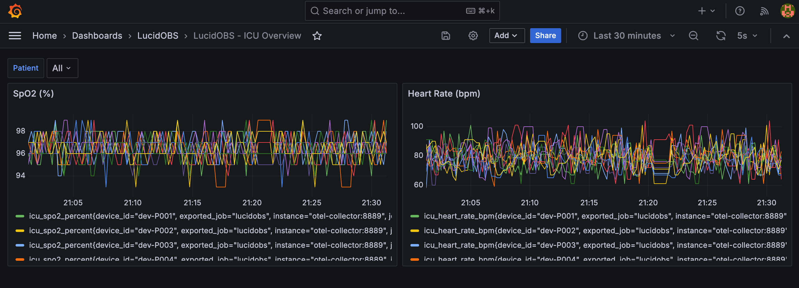

Grafana dashboard displaying heart rate and SpO₂ across multiple simulated ICU patients.

This provides a real-time operational overview of the ICU.

---

#### Patient Detail Dashboard

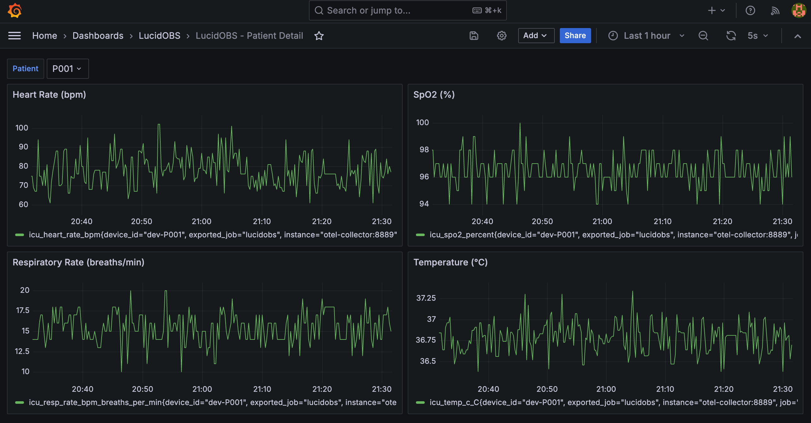

Grafana drill-down dashboard showing detailed vitals for a selected patient.

This demonstrates the ability to isolate and investigate individual telemetry streams.

---

**status: COMPLETE**

Telemetry and log streams operating as intended, patient overview and patient detial dashboards are running in real-time.

---

## Alerts and deterministic injection
**TODOt**
- Deterministic scenario injection via `lucidobs inject` writing `runtime/scenarios/overrides.json`
- Generator reads overrides and forces vitals for a specified patient and duration
- Logs annotate injected scenarios for auditing (`scenario` field)
- Grafana alert rules for:
  - low SpO₂
  - tachycardia

**Why this design**
- Alert demos must be reproducible. Random anomalies are unreliable for demo purposes and verification of alerts firing correctly.
- File-based overrides keep the system local-first and easy to debug.
- Alerts are defined on metrics (Prometheus), while logs provide narrative context for why an alert triggered.

**Key concepts**
- **Alert rules**: PromQL expressions evaluated on a schedule; fire when conditions persist for a duration.
- **Windows (over_time)**: min/max over a range smooths out noise and makes rules robust.
- **Deterministic injection**: controlled inputs to reliably demonstrate alert behaviour.

**Verificationy**
1) Started stack: `lucidobs up`
2) Started generator: `lucidobs run --patients 10 --rate 1 --seed 42`
3) Injected scenario: `lucidobs inject --event spo2_drop --patient P003 --duration 180`
4) Confirmed alert fires in Grafana Alerting within ~2–3 minutes.
5) Confirmed log annotation exists in Loki via LogQL search for `scenario`.

---

### Screenshots

#### SpO2 Alert

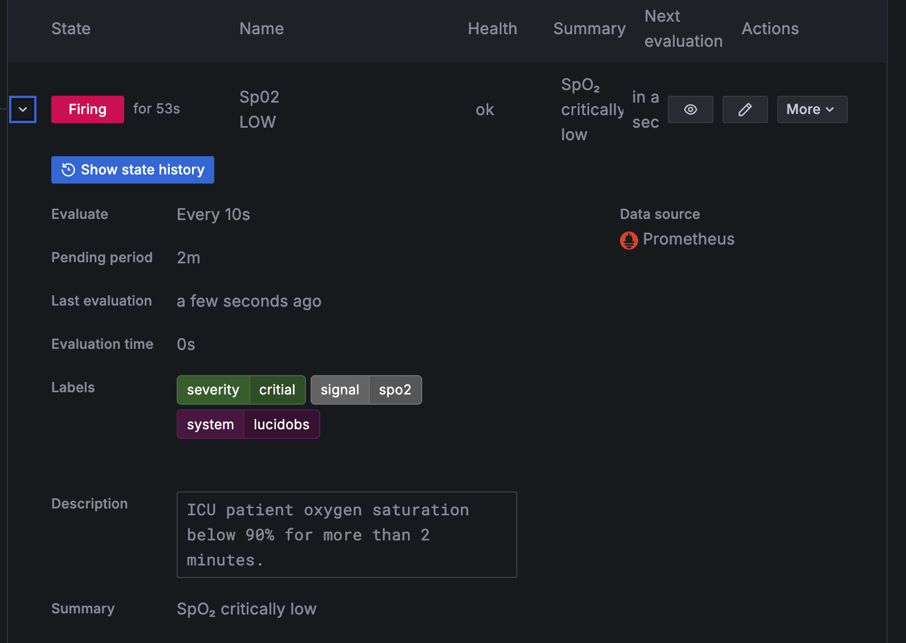

---

#### Tachycardia Alert

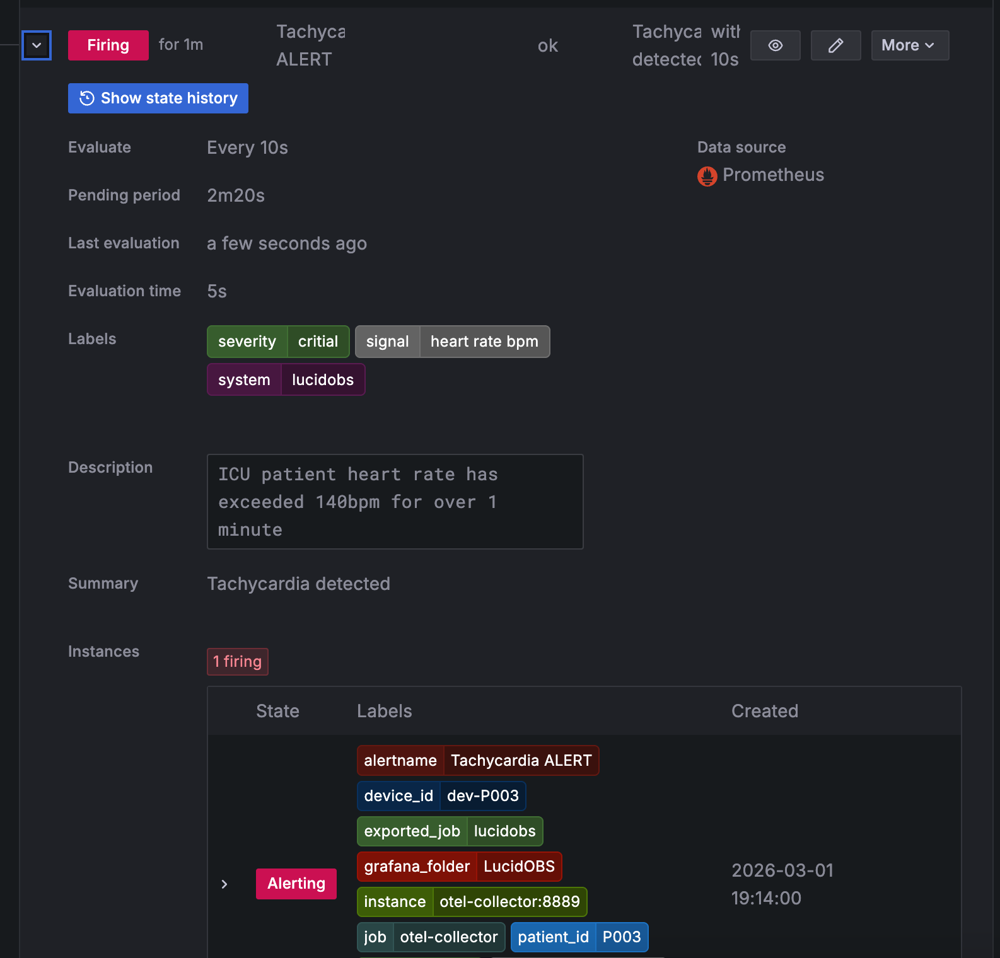

---

#### Confirm Log of Injected Scenario

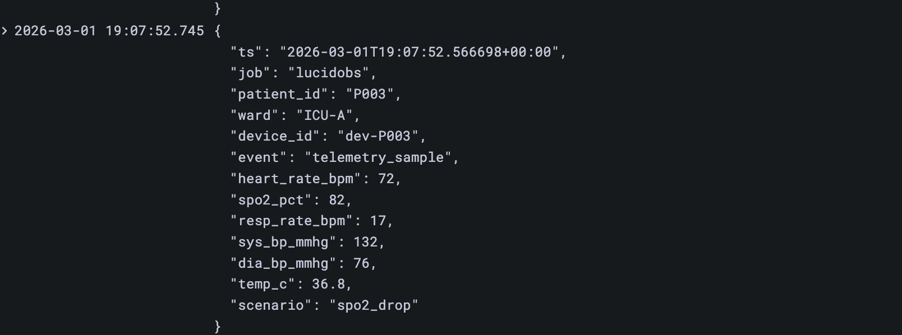

---

**status: COMPLETE**

Deterministic scenario injection successful and alerts traverse pending to firing as intended.

---

# Final Reflection

LucidOBS began as a simple telemetry generator and has evolved into a complete observability system.

It now demonstrates:

- structured log ingestion  
- time-series metrics monitoring  
- alert-driven incident detection  
- deterministic failure simulation  
- reproducible infrastructure  

The project highlights a key engineering principle:

- Observability is not visualisation.

- Observability is the ability to understand system state through telemetry.

LucidOBS provides that capability end-to-end.

---

# What I Learned

- OpenTelemetry architecture and telemetry pipelines

- Prometheus time-series monitoring

- Grafana alerting and dashboards

- Log ingestion and indexing via Loki

- Operational tooling and reproducible environments

---

# Definition of Done — Complete

LucidOBS successfully meets all original project goals.

It is fully reproducible, observable, and operational.

**Development complete.**

---