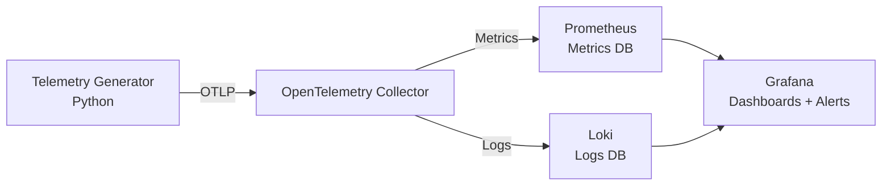

***
# LucidOBS
***

**ICU telemetry observability demo: OpenTelemetry → Prometheus/Loki → Grafana dashboards with alerts**

## Quickstart 
```bash
pip install -e .
lucidobs up
```

---

## Architecture Diagram



---