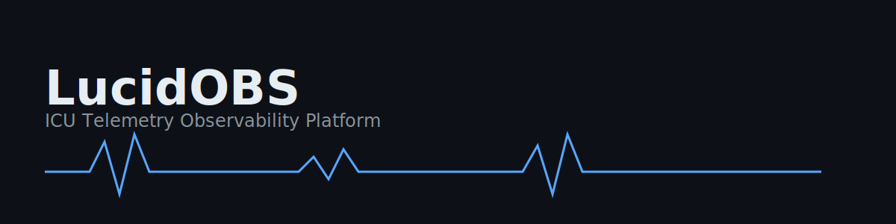
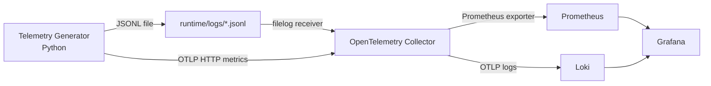

***
# LucidOBS
***

**ICU telemetry observability demo: OpenTelemetry → Prometheus/Loki → Grafana dashboards with alerts**

LucidOBS is a local-first observability system that simulates ICU patient telemetry, ingests logs and metrics via OpenTelemetry, and visualizes them in Grafana with real-time dashboards and alerts.

It demonstrates how modern observability stacks monitor critical systems using structured logs, time-series metrics, and automated alerting.

---

## What LucidOBS Demonstrates

- Structured logging → Loki → Grafana
- Metrics instrumentation → Prometheus → Grafana
- Alert rules → deterministic firing via controlled incident injection
- OpenTelemetry Collector as telemetry router
- Docker-based reproducible observability stack
- Operational CLI

LucidOBS emulates real production observability architectures used in healthcare, cloud infrastructure, and high-reliability systems.

---

## Why This Project Exists

Modern systems are blind without observability.

LucidOBS demonstrates how telemetry flows from source → collector → storage → visualization → alerting.

It focuses on correctness, reproducibility, and operational realism.

---

## Quickstart 

**Start LucidOBS:**
```bash
pip install -e .
lucidobs up
```

**Run Telemetry:**
```bash
lucidobs run --patients 10 --rate 1
```

This produces:

- ICU vitals metrics

- Structured telemetry logs

**Open Grafana:**
```bash
lucidobs grafana
```

Login:

- admin / admin


**Inject a critical SpO₂ drop:**
```bash
lucidobs inject --event spo2_drop --patient P003 --duration 180
```

**Observe alert firing in Alerting → Alert rules.**

Within ~2 minutes:

Alert will fire in:

Grafana → Alerting → Alert Rules

**Reset everything:**

```bash
lucidobs reset
```

---

### Grafana Exploration

- View dashboards:
  - **LucidOBS - Latest Events** (logs: Telemetry samples, Injected scenarios, System events)
  - **LucidOBS - ICU Overview** (multi-patient metrics: Heart rate, SpO₂, Respiratory rate, Temperature)
  - **LucidOBS - Patient Detail** (single patient drill-down for incident investigation)

- Alerts:
  - SpO₂ low: **(SpO₂ < 90%)**
  - Tachycardia: **HR > 140 bpm**

---

### Troubleshooting

**No logs in Grafana**
- Ensure generator is running: `lucidobs run ...`
- Check LucidOBS services are running: `lucidobs status`
- Check file is updating: `tail -n 3 runtime/logs/telemetry.jsonl`
- Loki label selector is: `{service_name="lucidobs"}`

**No metrics in Prometheus**
- Check Prometheus targets: http://localhost:9090/targets
- Query metric names in Prometheus: `{__name__=~"icu_.*"}`

**I ran the wrong environment**
- Verify CLI path: `which lucidobs`
- If needed: `pip install -e .` inside the correct env

---

## Architecture Diagram


---

## Screenshots

---

## Operational Workflow

LucidOBS demonstrates the typical observability workflow used during incident response.

1. **Telemetry generation**

ICU patient vitals are emitted as both:

- structured logs (JSONL)
- time-series metrics (OpenTelemetry)

2. **Telemetry ingestion**

The OpenTelemetry Collector routes telemetry:

- logs → Loki  
- metrics → Prometheus  

3. **Monitoring**

Grafana dashboards provide:

- ICU overview monitoring
- patient-level telemetry inspection
- live log streams

4. **Alert detection**

Alert rules detect abnormal conditions such as:

- SpO₂ < 90%
- heart rate > 140 bpm

5. **Incident investigation**

When alerts fire:

- engineers inspect metrics in Grafana
- logs are queried using LogQL
- affected patients and time ranges are identified

6. **Root cause investigation**

Patient drill-down dashboards and log streams enable engineers to trace abnormal telemetry patterns and determine system behaviour during the incident.

This workflow mirrors authentic observability practices used in cloud infrastructure, distributed systems monitoring, and healthcare telemetry environments.

---

### Logs

#### Live ICU Telemetry Log Stream (Grafana Dashboard)


Grafana dashboard displaying real-time ICU telemetry logs ingested via the OpenTelemetry Collector and stored in Loki.

End-to-end log ingestion pipeline functionality is confirmed.

---

#### LogQL Query in Grafana Explore


Direct LogQL query `{service_name="lucidobs"}` retrieving structured telemetry events.

This verifies logs are indexed and queryable independently of dashboards.

---

#### Raw JSONL Telemetry File


Local JSONL log file written by the telemetry generator.

This demonstrates the source of truth for telemetry before ingestion into the observability pipeline.

---

### Metrics

#### Prometheus Metric Query: icu_heart_rate_bpm


Prometheus successfully scraping ICU vitals metrics from the OpenTelemetry Collector.

Each time-series contains labels such as patient_id, ward, and device_id, enabling per-patient analysis.

---

#### ICU Overview Dashboard


Grafana dashboard displaying heart rate and SpO₂ across multiple simulated ICU patients.

This provides a real-time operational overview of the ICU.

---

#### Patient Detail Dashboard


Grafana drill-down dashboard showing detailed vitals for a selected patient.

This demonstrates the ability to isolate and investigate individual telemetry streams.


---

### Alerts

#### SpO2 Alert


---

#### Tachycardia Alert


---

#### Confirm Log of Injected Scenario


---

## Repository Structure

```text
lucidobs/
  configs/
  src/
  runtime/
  assets/
  docker-compose.yml
  README.md
  DEVLOG.md
```

---

## Definition of Done

LucidOBS meets all criteria:

- Logs visible in Grafana

- Metrics visible in Grafana

- Alerts fire deterministically

- Stack boots with one command

- CLI fully operational

- Screenshot evidence included

- Fully reproducible locally

---

## License

**MIT licence**

---

## Author

Alexander James Kershaw